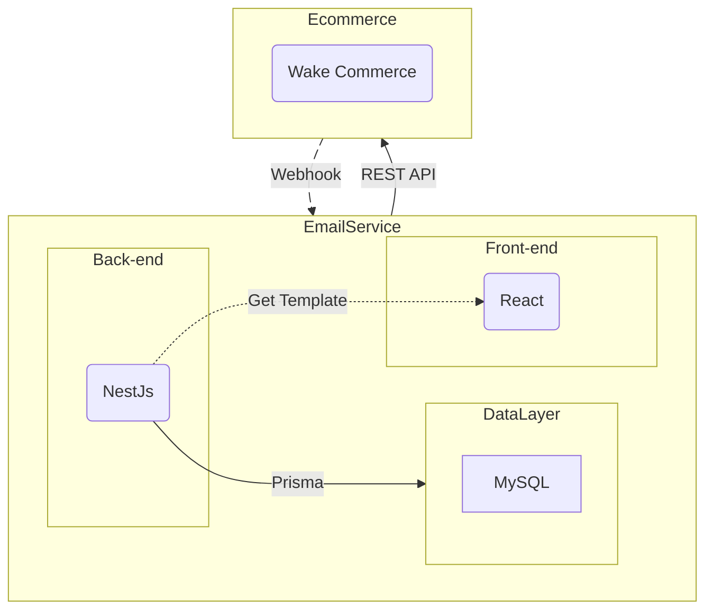
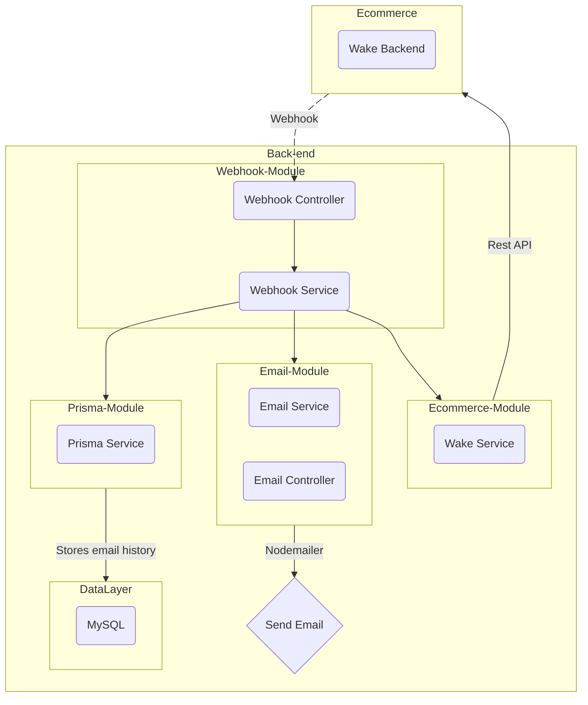

## Email Service - Workflow

```mermaid
flowchart TD

subgraph EmailService
direction LR
  subgraph Back-end
  App(NestJs)
  end

  subgraph DataLayer
  DB[MySQL]
  end

  subgraph Front-end
  EmailTemplates(React)
  end
end

subgraph Ecommerce
Wake(Wake Commerce)
end

App -.->|Get Template| EmailTemplates
Ecommerce e1@-->|Webhook| EmailService
EmailService -->|REST API| Ecommerce
App -->|Prisma| DataLayer

e1@{ animate: slow }
```

## Backend - Workflow

```mermaid
flowchart TD

subgraph Back-end
  subgraph Ecommerce-Module
  Wake("Wake Service")
  end

  subgraph Email-Module
  Email(Email Service)
  EmailController(Email Controller)
  end

  subgraph Webhook-Module
  Webhook(Webhook Service)
  WebhookController(Webhook Controller)
  end

  subgraph Prisma-Module
  Prisma(Prisma Service)
  end

  subgraph DataLayer
  DB(MySQL)
  end

  Webhook --> Email-Module
  Webhook --> Ecommerce-Module
  Webhook --> Prisma-Module

  Email-Module -->|Nodemailer| SendEmail{"Send Email"}
  Prisma-Module -->|Stores email history| DataLayer
end


subgraph Ecommerce
WakeBackend(Wake Backend)
end

Ecommerce e1@-->|Webhook| WebhookController --> Webhook
Ecommerce-Module -->|Rest API| Ecommerce

e1@{ animate: slow }

```
